# Academic Unified Rescue Aid

  <b>A modern academic productivity platform that unifies attendance, syllabus tracking, study planning, assignments, and AI-powered academic assistance into a single application.</b>

---

## About

**Academic Unified Rescue Aid** is a smart academic management platform built to help university students stay organized throughout their semester.

The application combines a **Flutter frontend** with a **FastAPI backend** to provide an intuitive, responsive, and intelligent experience for managing academic life.

From attendance tracking and syllabus management to study planning and academic insights, Academic Unified Rescue Aid serves as a centralized platform for everyday student productivity.

---

# Screenshots

## Authentication

| Login | Student Setup |
|-------|---------------|
| 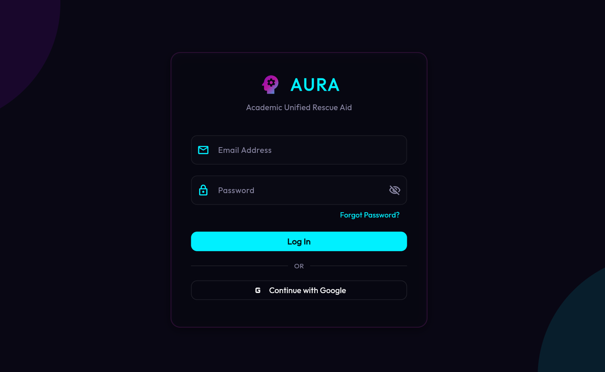 | 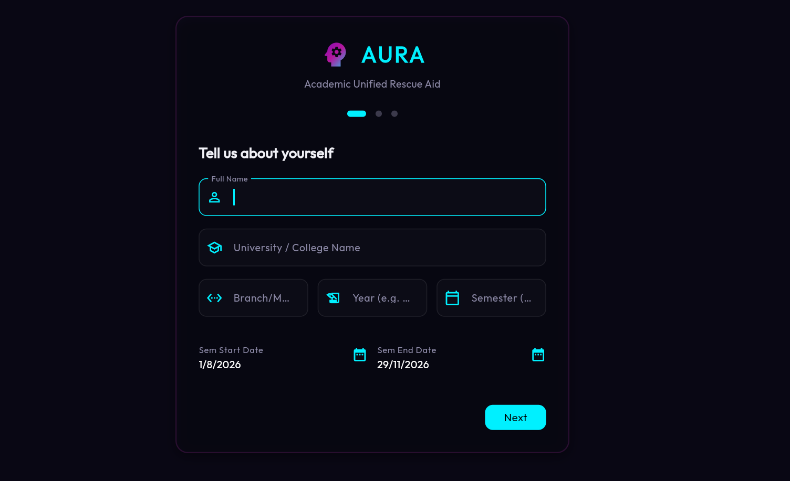 |

---

## Subject Configuration

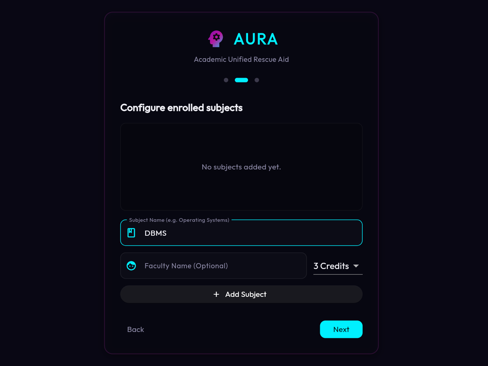

---

## Dashboard

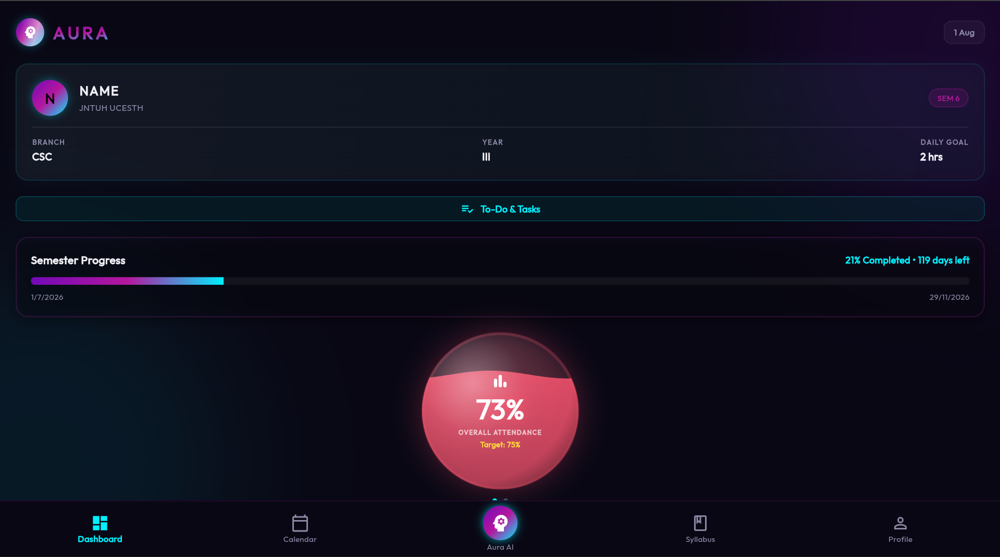

---

## Attendance Intelligence

### Attendance Log

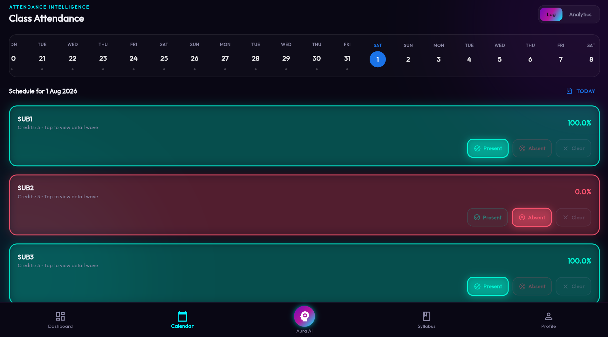

### Attendance Analytics

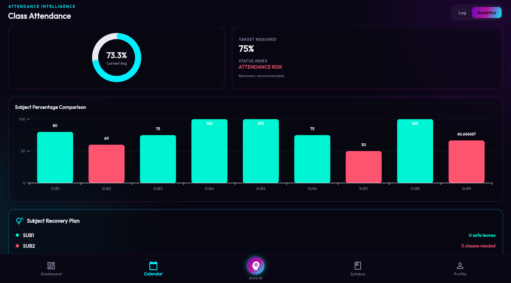

### Subject Recovery Plan

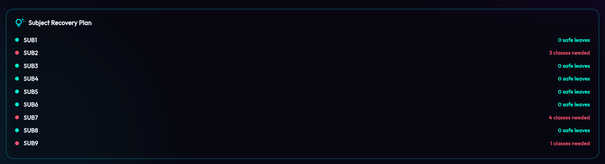

---

## Academic Assistant

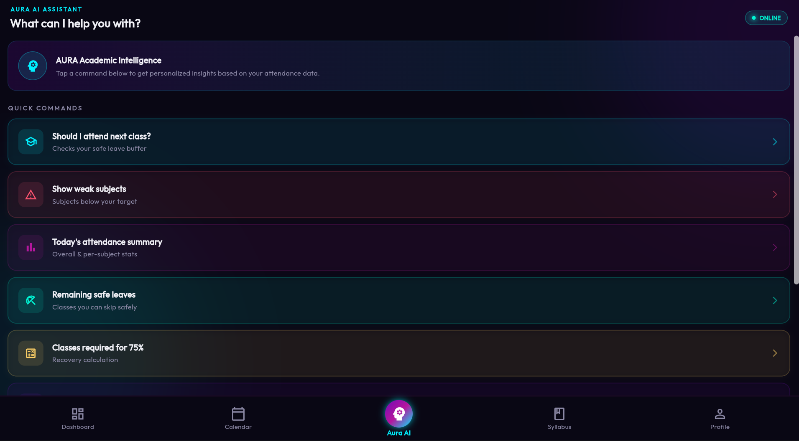

---

## Syllabus Planner

### Unit Tracker

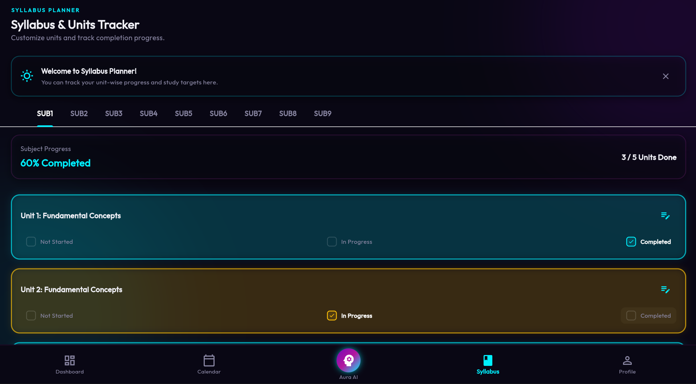

---

## Student Profile

### Profile Overview

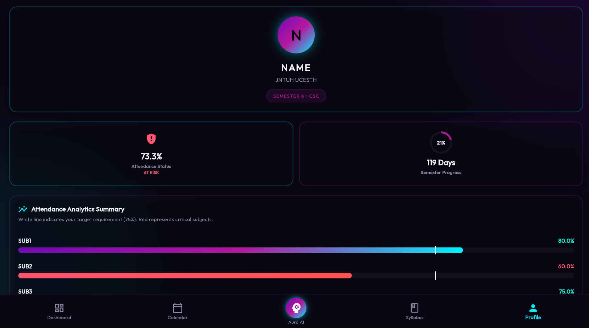

### Student Information

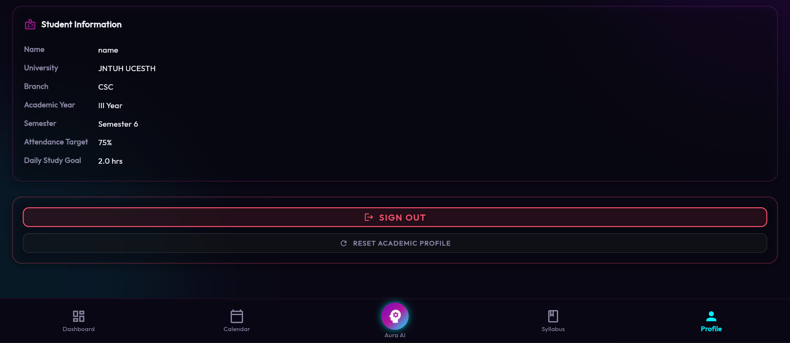

---

## Features

### Authentication
- Secure Email & Password Login
- Google Authentication
- Guided first-time onboarding

### Student Profile
- Academic profile setup
- University information
- Semester management
- Subject configuration

### Attendance Intelligence
- Daily attendance logging
- Attendance analytics
- Subject-wise attendance percentage
- Safe leave calculation
- Recovery planning
- Attendance risk detection

### Dashboard
- Academic overview
- Semester progress
- Attendance summary
- Daily goals
- Upcoming exams
- Pending assignments
- Priority task tracking

### Syllabus Planner
- Subject-wise unit tracking
- Completion status
- Progress visualization
- Study planning

### Academic Assistant
- AI-powered academic insights
- Attendance analysis
- Recovery suggestions
- Safe leave recommendations
- Academic guidance

### Productivity Tools
- Task management
- Daily goals
- Assignment reminders
- Exam planning

# Tech Stack

## Frontend
- Flutter
- Dart

## Backend
- FastAPI
- Python

## Database
- MongoDB
- Local fallback storage

## Authentication
- Google Authentication
- Email & Password Login

---

# Current Modules

- Authentication
- Student Onboarding
- Dashboard
- Attendance Intelligence
- Attendance Analytics
- Subject Recovery Planner
- AI Assistant
- Syllabus Planner
- Student Profile

---

# Future Enhancements

- Push Notifications
- Cloud Sync
- Smart Study Recommendations
- Calendar Integration
- Timetable Management
- Resource Sharing
- OCR Notes Scanner
- Offline Mode
- Multi-device Synchronization

---